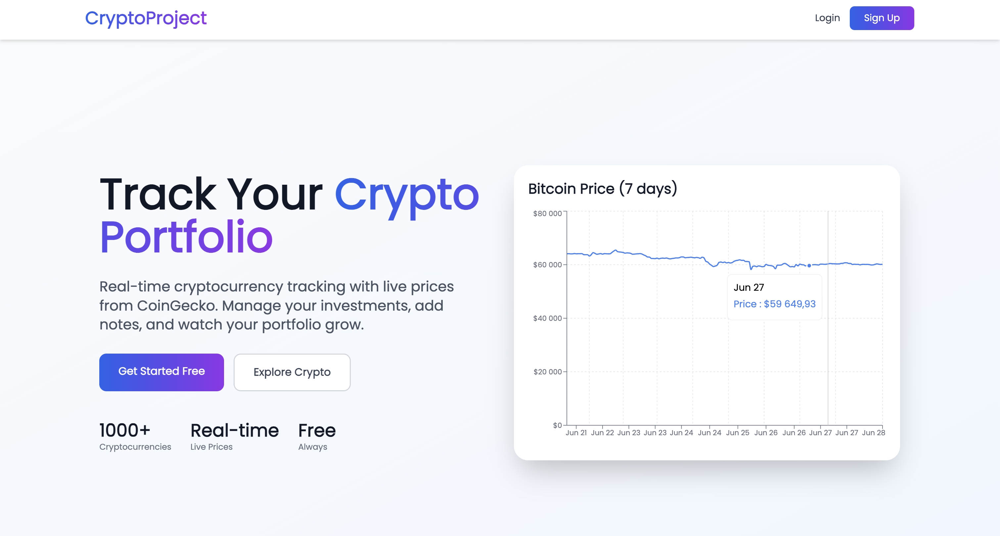
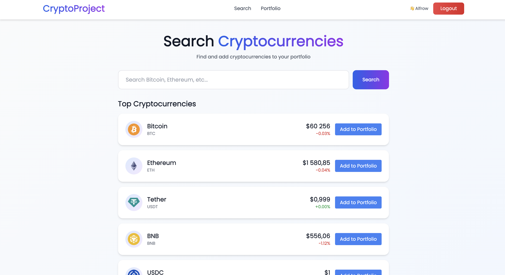

# Crypto Portfolio Tracker

A full-stack web application for tracking cryptocurrency portfolios with live price data from the CoinGecko API.


---

---

## Tech Stack

**Backend**
- ASP.NET Core Web API (.NET 8)
- ASP.NET Core Identity + JWT authentication
- Entity Framework Core + SQL Server
- CoinGecko API integration (IMemoryCache + SemaphoreSlim rate limiting)
- Repository Pattern, DI
- Swagger (API docs)

**Frontend**
- React 19 + TypeScript
- Recharts (price charts)
- Tailwind CSS
- React Router v7

---

## Features

- **User accounts** — register and log in with JWT-based authentication; passwords validated by ASP.NET Core Identity rules (length, uppercase, digit).
- **Live prices** — cryptocurrency data (price, 24 h change, logo) fetched from CoinGecko API with in-memory caching and concurrency limiting via `SemaphoreSlim`.
- **Portfolio management** — add assets by symbol, track quantity and total value; portfolio page fetches live prices in parallel via `Task.WhenAll` for fast loading.
- **Price charts** — historical price chart (7 / 30 / 90 days) rendered with Recharts.
- **Search** — search CoinGecko for any coin; results are enriched with local database IDs in a single query to avoid N+1.
- **Community notes** — authenticated users can leave comments on any asset; paginated list with create, update, delete (own comments only).
- **API documentation** — Swagger UI with JWT bearer support in development.

---

## Architecture

Single-project backend with layered organisation:

```
api/
├── Controllers/    AccountController, CryptoController, CryptoAssetController,
│                   PortfolioController, CommentController
├── Repository/     CryptoAssetRepository, CommentRepository, UserAssetsBalanceRepository
├── Services/       CoinGeckoService (external API), TokenService (JWT)
├── Interfaces/     Repository and service contracts
├── Models/         AppUser (IdentityUser), CryptoAsset, Comment, UserAssetBalance
├── Dtos/           Request and response DTOs per feature
├── Mappers/        Manual extension-method mappers
├── Middleware/     GlobalExceptionMiddleware
├── Migrations/     EF Core migrations
└── Helpers/        QueryObject (filtering + pagination)
```

**Many-to-many relationship** between `AppUser` and `CryptoAsset` is modelled through `UserAssetBalance` which also stores the quantity held.

---

## API

| Method | Path | Auth | Description |
|--------|------|------|-------------|
| `POST` | `/api/account/register` | — | Create account |
| `POST` | `/api/account/login` | — | Log in, receive JWT |
| `GET` | `/api/crypto/top` | — | Top N coins by market cap |
| `GET` | `/api/crypto/search?query=btc` | — | Search CoinGecko |
| `GET` | `/api/crypto/chart/{externalId}?days=7` | — | Historical price data |
| `GET` | `/api/CryptoAsset` | ✅ | List assets (filterable, paginated) |
| `GET` | `/api/CryptoAsset/{id}/live` | ✅ | Asset with live CoinGecko price |
| `POST` | `/api/CryptoAsset` | ✅ | Create asset |
| `PUT` | `/api/CryptoAsset/{id}` | ✅ | Update asset |
| `DELETE` | `/api/CryptoAsset/{id}` | ✅ | Delete asset |
| `GET` | `/api/Portfolio` | ✅ | User portfolio with live prices |
| `POST` | `/api/Portfolio` | ✅ | Add asset to portfolio |
| `DELETE` | `/api/Portfolio?symbol=BTC` | ✅ | Remove from portfolio |
| `GET` | `/api/Comment?cryptoAssetId=1` | ✅ | Paginated comments |
| `POST` | `/api/Comment/{cryptoAssetId}` | ✅ | Add comment |
| `PUT` | `/api/Comment/{id}` | ✅ | Edit own comment |
| `DELETE` | `/api/Comment/{id}` | ✅ | Delete own comment |

---

## Getting Started

### Prerequisites

- [.NET 8 SDK](https://dotnet.microsoft.com/download)
- SQL Server (local) or any EF Core-compatible database
- CoinGecko API key (free demo key at [coingecko.com](https://www.coingecko.com/en/api))

### 1. Clone the repository

```bash
git clone https://github.com/R3shotka/cryptoProject.git
cd cryptoProject
```

### 2. Configure the backend

Copy the example config and fill in real values:

```bash
cp api/appsettings.Example.json api/appsettings.json
```

Edit `api/appsettings.json`:

```json
{
  "CoinGecko": {
    "DemoApiKey": "YOUR_COINGECKO_API_KEY"
  },
  "ConnectionStrings": {
    "DefaultConnection": "Server=localhost,1433;Database=cryptodb;User Id=sa;Password=YOUR_PASSWORD;TrustServerCertificate=True"
  },
  "JWT": {
    "Issuer": "http://localhost:5144",
    "Audience": "http://localhost:5144",
    "SigningKey": "YOUR_JWT_SIGNING_KEY_AT_LEAST_256_BITS"
  }
}
```

### 3. Apply migrations

```bash
cd api
dotnet ef database update
```

### 4. Run the backend

```bash
dotnet run
```

Swagger UI is available at `https://localhost:{port}/swagger`.

### 5. Run the frontend

```bash
cd frontend
npm install
npm start        # http://localhost:3000
```

Create `frontend/.env` from the example:

```bash
cp frontend/.env.example frontend/.env
# set REACT_APP_API_URL=http://localhost:5144
```

---

## Running Tests

```bash
dotnet test
```

Tests live in `api.Tests/` and cover:

- `CryptoAssetRepositoryTests` — unit tests with EF Core InMemory database: GetAll, GetById, Create, Update, Delete, filtering by symbol, sorting by price.
- `CryptoAssetControllerIntegrationTests` — integration tests with `WebApplicationFactory`: 404 on missing asset, 201 on valid create, 400 on invalid data.

---

## Project Structure

```
cryptoProject/
├── api/
│   ├── Controllers/
│   │   ├── AccountController.cs        register, login
│   │   ├── CryptoController.cs         CoinGecko search, top, chart
│   │   ├── CryptoAssetController.cs    CRUD + live price endpoint
│   │   ├── PortfolioController.cs      user portfolio with live prices
│   │   └── CommentController.cs        paginated comments, own-only edit/delete
│   ├── Repository/
│   │   ├── CryptoAssetRepository.cs    filtering, sorting, pagination, search
│   │   ├── CommentRepository.cs        paginated fetch + total count
│   │   └── UserAssetsBalanceRepository.cs  many-to-many portfolio
│   ├── Services/
│   │   ├── CoinGeckoService.cs         IMemoryCache + SemaphoreSlim(5)
│   │   └── TokenService.cs             JWT generation
│   ├── Models/                         AppUser, CryptoAsset, Comment, UserAssetBalance
│   ├── Dtos/                           per-feature request/response DTOs
│   ├── Mappers/                        manual extension-method mappers
│   ├── Middleware/                     GlobalExceptionMiddleware
│   └── Migrations/
│
├── api.Tests/
│   ├── CryptoAssetRepositoryTests.cs
│   ├── CryptoAssetControllerIntegrationTests.cs
│   └── CustomWebApplicationFactory.cs
│
└── frontend/
    └── src/
        ├── Pages/      HomePage, CoinPage, PortfolioPage, SearchPage, LoginPage, RegisterPage
        ├── Components/ Search, BitcoinChart, Portfolio, Comment, Navbar, ProtectedRoute
        ├── Services/   api.service.ts, comment.service.ts, portfolio.service.ts
        └── Context/    AuthContext.tsx
```

---

## Key Technical Decisions

**CoinGecko rate limiting.** The free CoinGecko API has strict rate limits. `CoinGeckoService` uses `SemaphoreSlim(5)` to cap concurrent outbound requests and `IMemoryCache` to cache responses (search: 30 min, market data: 5 min, historical: 30 min). This prevents 429 errors under normal usage without an external cache dependency.

**Parallel portfolio pricing.** `PortfolioController` fetches live prices for all portfolio assets simultaneously with `Task.WhenAll` instead of sequentially — loading time scales with the slowest single request, not the sum of all.

**Search enrichment in one query.** When enriching CoinGecko search results with local database IDs, the controller collects all `externalId` values and calls `GetIdsByExternalIdsAsync` once, then maps results in memory — avoiding an N+1 query pattern.

**Own-comment-only edit/delete.** `CommentController` checks `existingComment.AppUserId != appUser.Id` before allowing update or delete, returning `403 Forbidden` rather than `404` to distinguish "not found" from "not allowed".

**JWT with ASP.NET Core Identity.** `TokenService` generates signed JWTs; `ClaimsExtensions` reads the username claim from `HttpContext.User` in controllers — decoupling claim parsing from controller logic.
